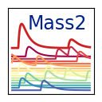

# Mass 2: Microcalorimeter Analysis Software Suite

## Overview of Mass 2

Mass is a Python software suite designed to analyze pulse records from high-resolution, cryogenic microcalorimeters. We use Mass with pulse records from x-ray and gamma-ray spectrometers, performing a sequence of analysis, or "calibration" steps to extract a high-precision estimate of the energy from each record.

With raw pulse records and Mass, you can:

* Analyze data from one or multiple detectors at one time.
* Analyze data from one or more raw pulse data files per detector.
* Analyze a fixed dataset taken in the past, or perform "online" analysis of a dataset still being acquired.
* Analyze data from time-division multiplexed (TDM) and microwave-multiplexed (µMUX) systems.
* Compute and apply "optimal filters" of various types.

With or without raw pulse records, further analysis tasks that Mass helps with include:

* Choose and apply data cuts.
* Fix complex line shapes in an energy spectrum.
* Estimate and apply accurate functions for absolute-energy calibration.
* Win friends and influence people.

## Major concepts

Mass2 is built around a few core technologies:

1. [Pola.rs](https://pola.rs/), a high-performance modern dataframe library. Organizes the data structures and provides data I/O.
2. [Numpy](https://numpy.org/). For numerical arrays and scientific computation.
3. [Scipy](https://scipy.org/). Additional algorithms for scientific computation.
4. [LMFIT](https://lmfit.github.io/lmfit-py/). Convenient non-linear curve fitting.

A particularly important change is that Mass 2 leverages Pola.rs for data organization. Therefore, for a critical portion of the code, the larger open-source software community provides the documentation, bug fixes, and testing.
